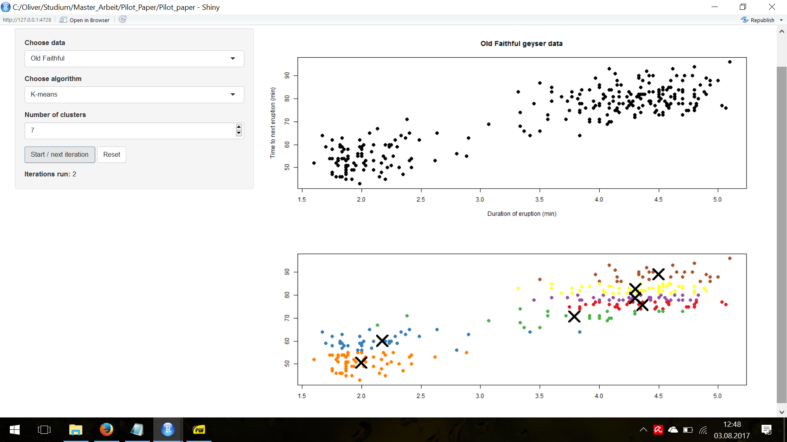

[](http://quantlet.de/)

## [](http://quantlet.de/) **DAIIkmeansEM** [](http://quantlet.de/)

```yaml


Name of Quantlet: DAIIkmeansEM

Published in: "--"

Description: Visualizes k means and EM clustering with Old Faithful and Iris data

Keywords: cluster analysis, k means clustering, EM clustering, Old Faithful, Iris

Author: Oliver Frost

Submitted: Fri, August 04 2017 by Alla Petukhina

Datafile: None

Input: User input

Output: Interactive Shiny app
```



### R Code
```r


  ###################################################################################
  ### This script builds an app that visualizes two common clustering algorithms. ###
  ###################################################################################


library(shiny)
library(shinyjs)
library(mclust)


# Define the colors of the clusters
palette(c("#E41A1C", # red
          "#377EB8", # blue
          "#4DAF4A", # green
          "#984EA3", # purple
          "#FF7F00", # orange
          "#FFFF33", # yellow
          "#A65628", # brown
          "#F781BF", # pink
          "#999999", # grey
          "#000000"  # black
          ))


  ##########
  ### UI ###
  ##########

ui = fluidPage(
  
  useShinyjs(),
  
  headerPanel(title = 'Cluster analysis'),
  
  sidebarPanel(
    
    selectInput(inputId = "data", label = "Choose data", 
                choices = c("Old Faithful", "Iris"), 
                selected = "Old Faithful"),
    
    conditionalPanel(
      condition = "input.data == 'Iris'",
      selectInput(inputId = "xcol", label = "X variable", choices = names(iris[1:4])),
      selectInput(inputId = "ycol", label = "Y variable", choices = names(iris[1:4]),
                  selected = names(iris)[[2]])),
    
    selectInput(inputId = "algorithm", label = "Choose algorithm", 
                choices = c("K-means", "EM"), selected = "K-means"), 
    
    numericInput(inputId = "num_cls", label = "Number of clusters", value = 2, min = 2, max = 10),
    
    actionButton(inputId = "run_algorithm", label = "Start / next iteration"),
    
    actionButton(inputId = "reset", label = "Reset"),
    
    tags$div(
      style="margin-top:14px;",
      uiOutput(outputId = "num_its"))
    
  ),
  
  mainPanel(
    plotOutput("plot_orig"),
    plotOutput("plot_cl")
    )
  )


  ##############
  ### SERVER ###
  ##############

server = function(input, output) {

  ### Plot the data set selected ###
  output$plot_orig = renderPlot({
    
    if (input$data == "Old Faithful") {
      plot(faithful, main = "Old Faithful geyser data", pch = 20, cex = 2, col = "black",
           ylab = "Time to next eruption (min)", xlab = "Duration of eruption (min)")
      } else {
        plot(iris[, c(input$xcol, input$ycol)], main = "Iris flower data", pch = 20, cex = 2, 
             col = iris$Species)
        legend("bottomright", legend = c("I. setosa", "I. versicolor", "I. virginica"), 
               pch = 20, col = c("#E41A1C", "#377EB8", "#4DAF4A"))
        }
    })
  
  
  ### Counter ###
  
  # Initialize a counter of iterations
  v = reactiveValues(counter = 0)
  
  # Specify when to reset the counter
  observeEvent(input$data, {v$counter = 0})
  observeEvent(input$reset, {v$counter = 0})
  observeEvent(input$algorithm, {v$counter = 0})
  observeEvent(input$num_cls, {v$counter = 0})
  observeEvent(input$xcol, {v$counter = 0})
  observeEvent(input$ycol, {v$counter = 0})
  
  
  ### Old Faithful ###
  
  # Run k-means algorithm
  km_of = reactive({
     set.seed(123)
     kmeans(faithful, input$num_cls, iter.max = v$counter, nstart = 1)
     })
  
  # Run EM algorithm
  em_of = reactive({
    set.seed(123)
    Mclust(faithful, G = input$num_cls, control = emControl(itmax = c(v$counter, 1)))
    })
 

  ### Iris ###

  # Run k-means algorithm
  km_iris = reactive({
    set.seed(123)
    kmeans(iris[, c(input$xcol, input$ycol)], input$num_cls, iter.max = v$counter, nstart = 1)
  })

  # Run EM algorithm
  em_iris = reactive({
    set.seed(123)
    Mclust(iris[, c(input$xcol, input$ycol)], G = input$num_cls, control = emControl(itmax = c(v$counter, 1)))
  })
  
  
  ### Plot clusters ###

  p = eventReactive(input$run_algorithm, {
    
    v$counter = v$counter + 1
    
    
    # Old Faithful
    if (input$data == "Old Faithful" & input$algorithm == "K-means") {
      plot(faithful, col = km_of()$cluster, pch = 20, cex = 2, ylab = "", xlab = "")
      points(km_of()$centers, pch = 4, cex = 4, lwd = 4)
    }
    
    if (input$data == "Old Faithful" & input$algorithm == "EM") {
      plot(faithful, col = em_of()$classification, pch = 20, cex = 2, ylab = "", xlab = "")
      points(x = em_of()$parameters$mean[1, ], y = em_of()$parameters$mean[2, ],
             pch = 4, cex = 4, lwd = 4)
    }
      
    
    # Iris
    if (input$data == "Iris" & input$algorithm == "K-means") {
          
      plot(iris[, c(isolate(input$xcol), isolate(input$ycol))], col = km_iris()$cluster,
             pch = 20, cex = 2, ylab = "", xlab = "")
      points(km_iris()$centers, pch = 4, cex = 4, lwd = 4)
    }

    if (input$data == "Iris" & input$algorithm == "EM") {
      plot(iris[, c(isolate(input$xcol), isolate(input$ycol))], col = em_iris()$classification,
           pch = 20, cex = 2, ylab = "", xlab = "")
      points(x = em_iris()$parameters$mean[1, ], y = em_iris()$parameters$mean[2, ],
             pch = 4, cex = 4, lwd = 4)
    }
  
  })
  
  output$plot_cl = renderPlot({p()})
  
    
  # Show number of iterations run
  output$num_its = renderText({HTML(paste0("<b>","Iterations run: ","</b>", v$counter))})
  
  
  # Specify when to hide and show the cluster plot
  observeEvent(input$reset, {hide("plot_cl")})
  observeEvent(input$data, {hide("plot_cl")})
  observeEvent(input$algorithm, {hide("plot_cl")})
  observeEvent(input$num_cls, {hide("plot_cl")})
  observeEvent(input$xcol, {hide("plot_cl")})
  observeEvent(input$ycol, {hide("plot_cl")})
  observeEvent(input$run_algorithm, {show("plot_cl")})
  
}


shinyApp(ui = ui, server = server)
```

automatically created on 2018-10-15